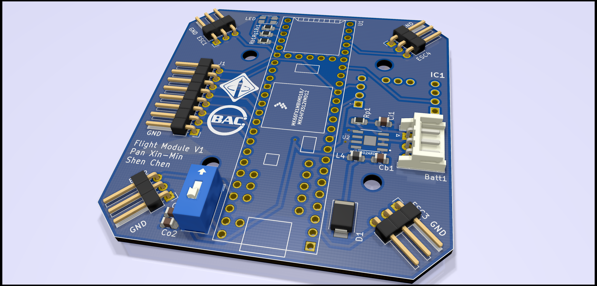
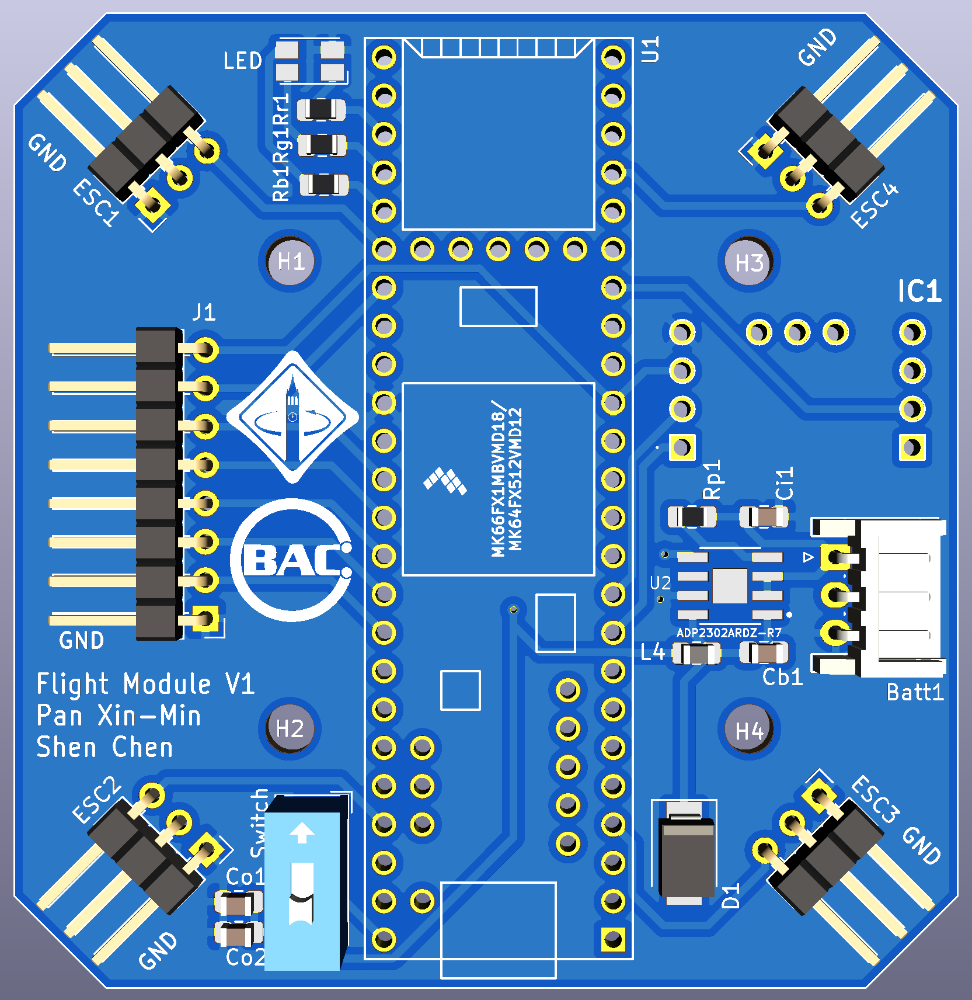

TeensyWii v0.0
===================================

TeensyWii is an attempt to make MultiWii Teensy 3.5 compatible. This a personal project on trying to build a drone from the ground up (except the frame but I might have something for that too coming soon-ish ;) ). Thanks to UC Berkeley's Hands-On PCB Engineering Decal for teaching how to create a PCB. This firmware is designed to run on that PCB. Schematics coming soon!

